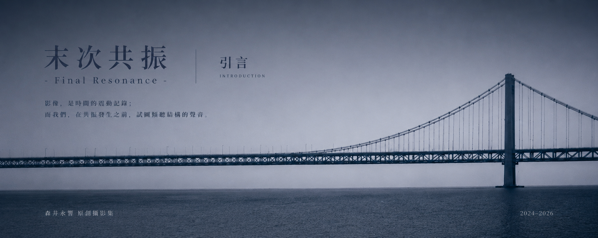

::music{title="Final Resonance" artist="ARForest" cover="https://p2.music.126.net/mHwD8HW8bAKn1BnQfMbDAQ==/109951172872220439.jpg" audio="assets/music/ARForest - Final Resonance.aac" lrc="https://meting.spr-aachen.com/api?server=netease&type=lrc&id=1363298691"}

末次，是一场振动的终止，也是能量在结构中的最后一次回响。桥梁在荷载极限前反覆受力，直至某一刻，结构不再回应外界的激励，只留下自身记忆的残响。

这里是森井永響原创摄影集#0《末次共振 -Final Resonance-》的导航页，收录了摄影集中所有作品的电子存档。本文将分为2024、2025和2026三个章节，以下是对应章节的跳转链接。

占位1

占位2

占位3

> 为真正停留下来的，
> 从来不是声音；
> 而是声音消失之后，
> 空间里仍未散去的回响。
